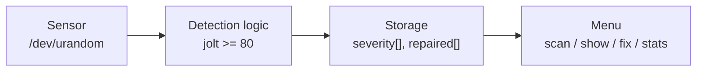
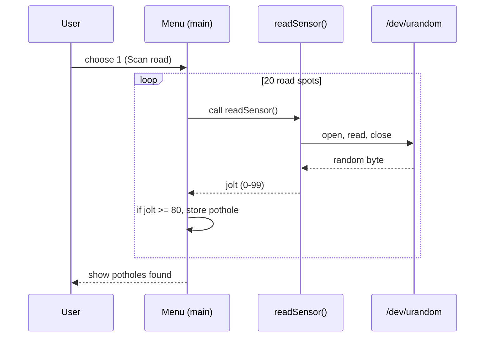
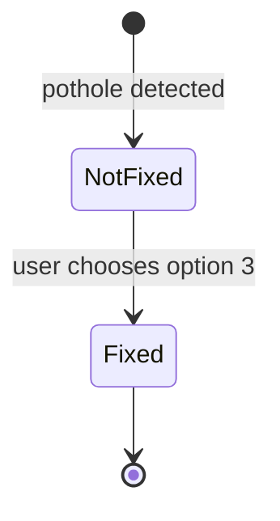

# Design Document - Road Pothole Tracker

## 1. Requirements

**Functional**
- FR1: Simulate a road sensor and scan road spots for jolts.
- FR2: Detect a pothole when the reading is 80 or more (out of 100).
- FR3: Assign a severity (low, medium, high) based on the reading.
- FR4: List all potholes with severity and status.
- FR5: Mark a pothole as fixed by its number.
- FR6: Show statistics (total, fixed, not fixed).

**Non-functional**
- Written in C++ only, runs on Linux.
- Simple console menu, no extra hardware needed.
- Stores up to 100 potholes in memory.

## 2. Architecture

## 3. Data structures and interfaces

| Item | Type | Purpose |
|---|---|---|
| `severity[100]` | int array | 1 = low, 2 = medium, 3 = high |
| `repaired[100]` | int array | 0 = not fixed, 1 = fixed |
| `total` | int | number of potholes stored |
| `readSensor()` | function | returns 0-99 using open/read/close on /dev/urandom |

Index `i` in both arrays belongs to the same pothole.

## 4. Sequence diagram (Scan road)

## 5. State diagram (pothole status)

## 6. Project plan and milestones

| Milestone | Status |
|---|---|
| Requirements and design | Done |
| Linux setup (Ubuntu in VirtualBox) | Done |
| Implementation (pothole.cpp) | Done |
| Testing all menu options | Done |
| GitHub upload and README | Done |
| Documentation and presentation | Done |

## 7. Testing

| Test | Expected result |
|---|---|
| Scan road (option 1) | Prints potholes found, or none on a smooth run |
| Show potholes (option 2) | Lists every pothole with severity and status |
| Mark fixed with valid number | Status changes to FIXED |
| Mark fixed with wrong number | Prints "Wrong number." |
| Stats (option 4) | Total = fixed + not fixed |

## 8. Version control
The project uses Git with a single `main` branch, hosted on GitHub.
