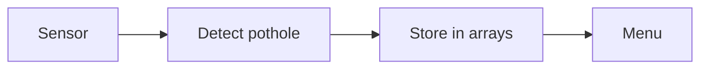
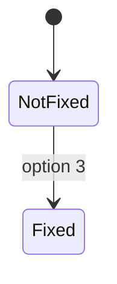

# Design

## What the program must do
- Scan the road and find potholes
- Show all potholes with severity and status
- Mark a pothole as fixed
- Show total, fixed and not fixed

## Parts of the program

## Data used
- `severity[100]` - 1 is low, 2 is medium, 3 is high
- `repaired[100]` - 0 is not fixed, 1 is fixed
- `total` - how many potholes we have

Both arrays use the same number for the same pothole.

## Pothole status

## Testing
| Test | Result |
|---|---|
| Scan road | shows potholes found |
| Show potholes | lists all with status |
| Fix a valid number | status becomes FIXED |
| Fix a wrong number | prints "Wrong number." |
| Stats | total = fixed + not fixed |
